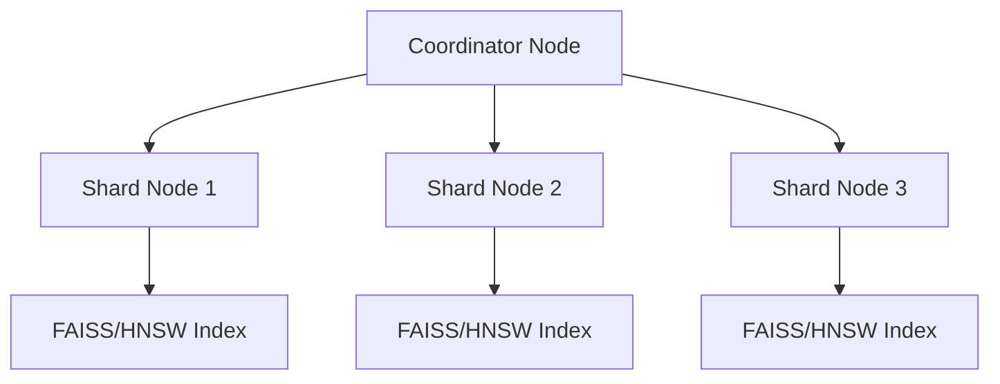

Here's a professional README.md for your distributed vector database project:

```markdown
# Distributed Vector Database for High-Dimensional Image Embeddings

[](https://www.python.org/downloads/)
[](https://www.docker.com/)

A distributed vector database system designed for efficient similarity search on high-dimensional image embeddings with sharding and distributed query execution capabilities.

## Features

- **Horizontal Sharding** of vector data across 2-3 nodes
- **Distributed Similarity Search** with result merging
- **LSH-based Indexing** for efficient sharding
- **Fault Tolerance** (basic replication support)
- **Docker-based Orchestration**
- **COCO Image Embeddings** support + synthetic data generation
- **Performance Monitoring** for latency vs recall tradeoffs
- **Dimension Reduction** from 2048D ResNet embeddings to 512D using PCA

## Architecture



- **Coordinator**: Handles query routing and result merging
- **Shard Nodes**: Store partitioned vector data with FAISS/HNSW indexes
- **LSH Sharding**: Locality-Sensitive Hashing for distributed indexing
- **Dimension Reduction**: PCA-based reduction from 2048D to 512D

## Installation

### Prerequisites
- Python 3.8+
- Docker 20.10+
- FAISS/HNSW libraries

```bash
# Clone repository
git clone https://github.com/yourusername/distributed-vector-db.git
cd distributed-vector-db

# Install dependencies
pip install -r requirements.txt

# For GPU support (recommended):
docker pull faiss-gpu
```

## Data Preparation

1. Download COCO dataset embeddings:
```bash
wget http://images.cocodataset.org/annotations/annotations_trainval2017.zip
unzip annotations_trainval2017.zip
```

2. Generate image embeddings:
```bash
python generate_coco_embeddings.py --coco-dir data/coco --output data/coco_embeddings.npz --model resnet50
```

3. Load embeddings into the database:
```bash
python load_coco_embeddings.py --embeddings data/coco_embeddings.npz --target-dim 512 --reduction-method pca
```

## Configuration

### Coordinator Config (`config/coordinator.yaml`)
```yaml
nodes:
  - host: 172.17.0.2
    port: 5001
  - host: 172.17.0.3
    port: 5002
sharding_strategy: lsh
replication_factor: 1
```

### Shard Node Config (`config/shard_node.yaml`)
```yaml
storage_path: /data/shards
index_type: HNSW
index_params:
  space: cosine
  M: 16
  ef_construction: 200
vector_dimension: 512  # After dimension reduction
```

## Running the System

### Using the run_system.py Script

The easiest way to run the entire system is using the provided script:

```bash
# Run all components
python run_system.py --run-all

# Or run specific components
python run_system.py --load-embeddings --run-search --analyze-performance
```

### Manual Execution

1. Start Shard Nodes:
```bash
docker-compose up --scale shard_node=3
```

2. Start Coordinator:
```bash
python coordinator.py --config config/coordinator.yaml
```

3. Load Embeddings:
```bash
python load_coco_embeddings.py --embeddings data/coco_embeddings.npz --target-dim 512
```

4. Run Search Queries:
```bash
python visualize_results.py --embeddings data/coco_embeddings.npz --target-dim 512
```

## Dimension Reduction

The system handles high-dimensional embeddings from ResNet models (2048D) by reducing them to a more manageable dimension (512D) using Principal Component Analysis (PCA). This reduction:

- Improves storage efficiency
- Reduces computational complexity
- Maintains semantic similarity relationships
- Enhances search performance

The dimension reduction is performed consistently during:
- Data loading (`load_coco_embeddings.py`)
- Search operations (`visualize_results.py`)
- Performance analysis (`performance_analysis.py`)

## Performance Analysis

Run the performance analysis script to evaluate:
- Search latency vs. k (number of results)
- Vector distribution across shards
- Latency distribution

```bash
python performance_analysis.py --analyze-distribution --benchmark-k
```

## Generating Reports

Generate a comprehensive PDF report with visualizations:

```bash
python generate_report.py
```

## License

MIT License